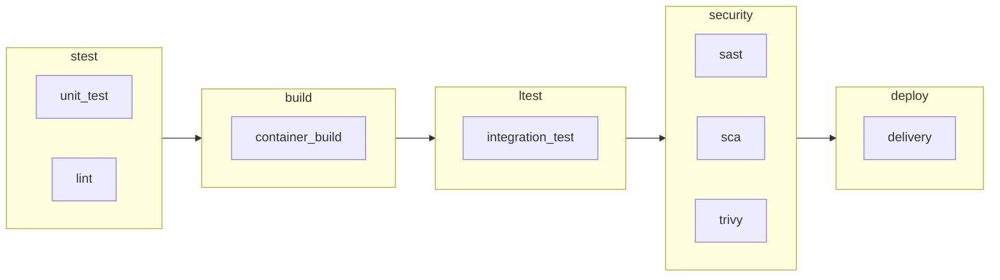

# ExampleSampleService
Goアプリのパイプラインテスト用のサンプルアプリ


## 動かし方
Makefileを見てください


## パイプライン
### フローチャート図



### ステージ
#### stest
ローカルで実施するようなテストをここで実施する。例えばgo test やgolangci-lintによるlintなどが該当する。
#### build
コンテナをビルドする。ビルド方法はマルチステージビルドを採用。下をみておけば大丈夫だと思う。
https://docs.docker.com/language/golang/build-images/
開発用のブランチでビルドしたいとかであれば、適当なリポジトリに対して、パイプラインのIDだったり、コミットのハッシュ値だったりをつけておけば、一意になるんじゃないかな。

#### ltest
外接のシステムだったり、DBだったり、フロントのアプリから打鍵したいって場合はここで書く。テスト面へのリリースだったりもあるのかも。今回のサンプルは超簡単なもののため特に書いていません。

#### security
sast, iast, dast だったりのセキュリティ系のテストだったり、イメージスキャンだったり、SBOMの作成などはこちら。ここから先はリリースするときのブランチで回せばいいんじゃないかな。シフトレフトしたいから、開発時でも回したいですというのあれば、それはそれでいいと思います。

#### deploy
イメージをリリース用のレジストリに配置したり、そこからリリースのジョブを流したりする。Blue Greenでやりたいときやカナリアでやりたい時など、いろいろ方式や統制があると思うので、どこまでパイプラインでやりたいかは事前に話し合うこと。


### ジョブ
#### unit_test
Makefileによる単体テストを実施する。Makefileはgo testを快適にするためのツールをいくつか利用している。
- gocover-covertura: go testの結果得られたcoverprofileをcovetura形式のフォーマットに変更する。私はGitlabを利用しているので、artifactにcovertura形式のファイルをartifactに設定すると、いい感じにカバレッジを表示することができる
- go-junit-report: go testの結果をjunit形式に変更してくれる。これもgitlabのartifactに設定するといい感じに出してくれる。
  
https://gitlab-docs.creationline.com/ee/ci/junit_test_reports.html

#### lint
golangci-lintを利用している。Go言語のlinterをまとめてくれて設定ファイル一つで静的解析するルールを設定できる便利なものだ。公式ではgo install によるダウンロードは推奨していないのだが、他のツールの同じようにしたいのと、別にlintツールなので、まあ動かなくなってもいいやということでgo installをしている。ルールはとりあえずデフォルトでやっておく。


#### trivy
sbomは下記のように出す。なんかartifactか何かに入れておいて、スケジュールでこのSBOMに対してスキャンかけてSCAするんじゃないかな。知らんけど。

```bash:sbom
trivy image --format cyclonedx --output sbom.json example-sample-service:0.0.1
```
出たものに対しての解析はこれで実施。
```
trivy sbom sbom.json
```

## まとめ
とりあえず、これだけやっていれば大丈夫でしょっていうパイプライン構成を考えてみた。あとはよしなに肉付けしてください。
